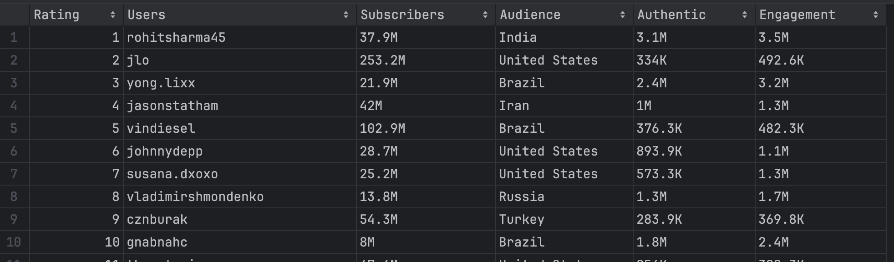
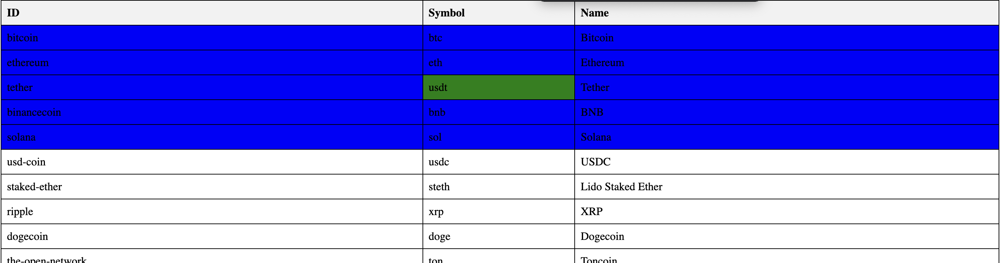
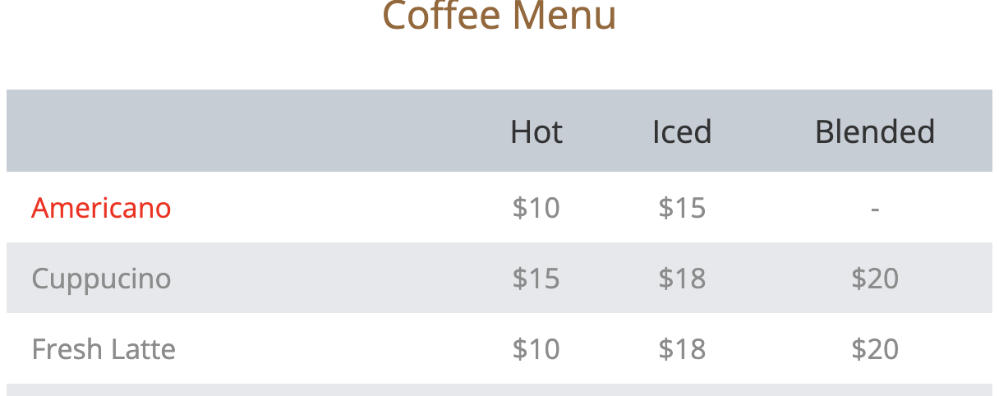
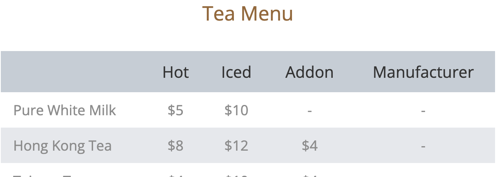
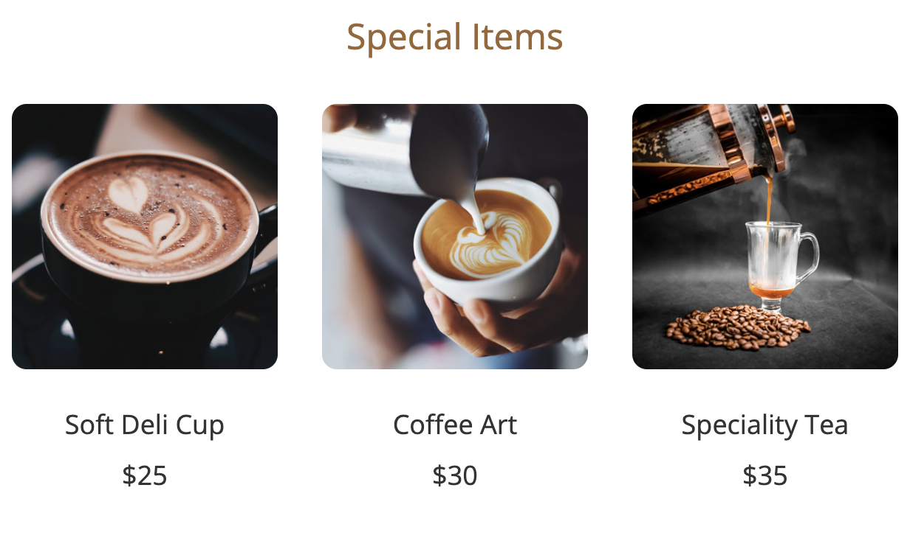
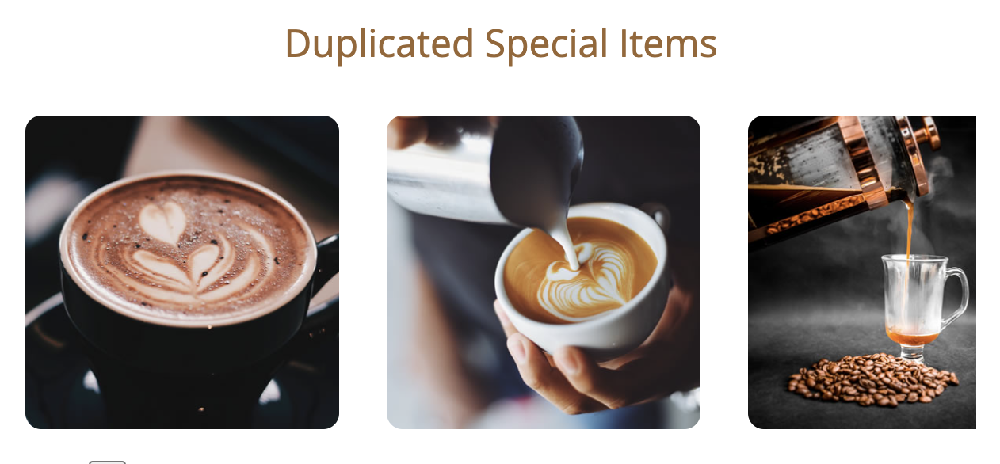
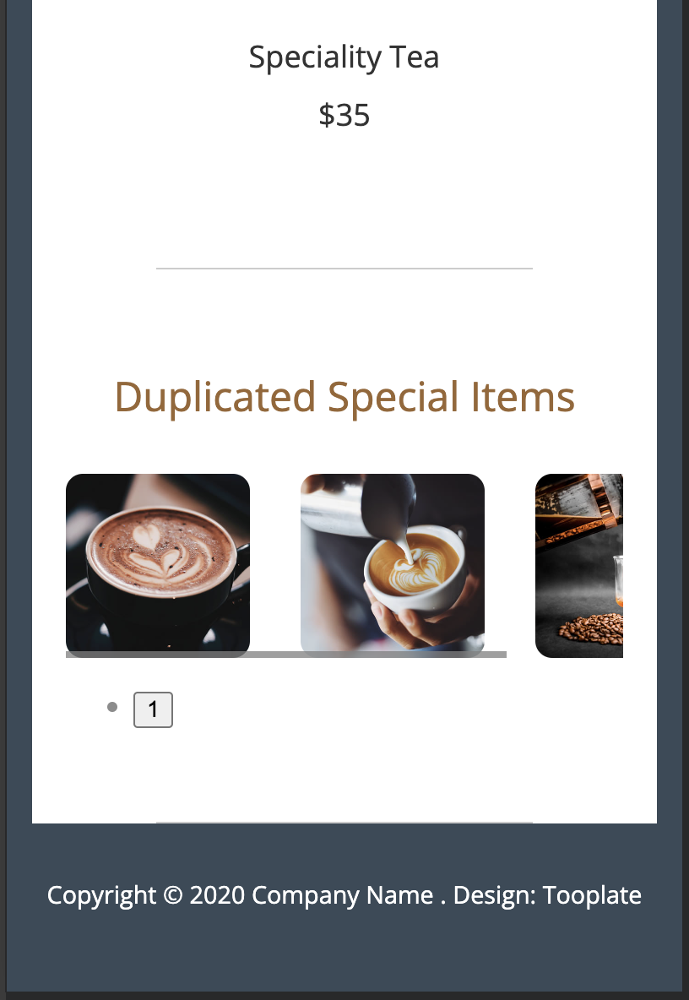

# Один Плюс
 
If you want to clone this repo, then here is instruction:
```
cd existing_repo
git clone https://github.com/tlglv-n/OnePlusTasks.git
```

# Task 1

- All inputs work with terminal
- Write without mistakes as btc, not тbtc, deleting initially "т", because fmt.Scan couldn't read it correctly


! Be sure that every 10 mins in terminal we will get message: "Currencies updated" by requirements

# Task 2

- Here is implemented parser in Golang using URL
- It shows 50 listed persons with columns as rating, users, subscribers and etc.




# Task 3

- The first 5 rows have been colored with blue as background, and usdt is colored green
- In conditions, no where written that other columns in "usdt" have been green, so I kept them blue



# Task 4

- "Americano" text is red
  
  
- In "Tea menu" added "Manufacturer" column
  
  
- Images in "Special items" have rounded borders
  
  
- "Special items" were duplicated and they have slider in horizontal
  
  
- In mobile version, there is no "About our cafe"
  
  


# Contacts:
Nurdaulet - zander559@mail.ru
LinkedIn - https://www.linkedin.com/in/tlglvn/


